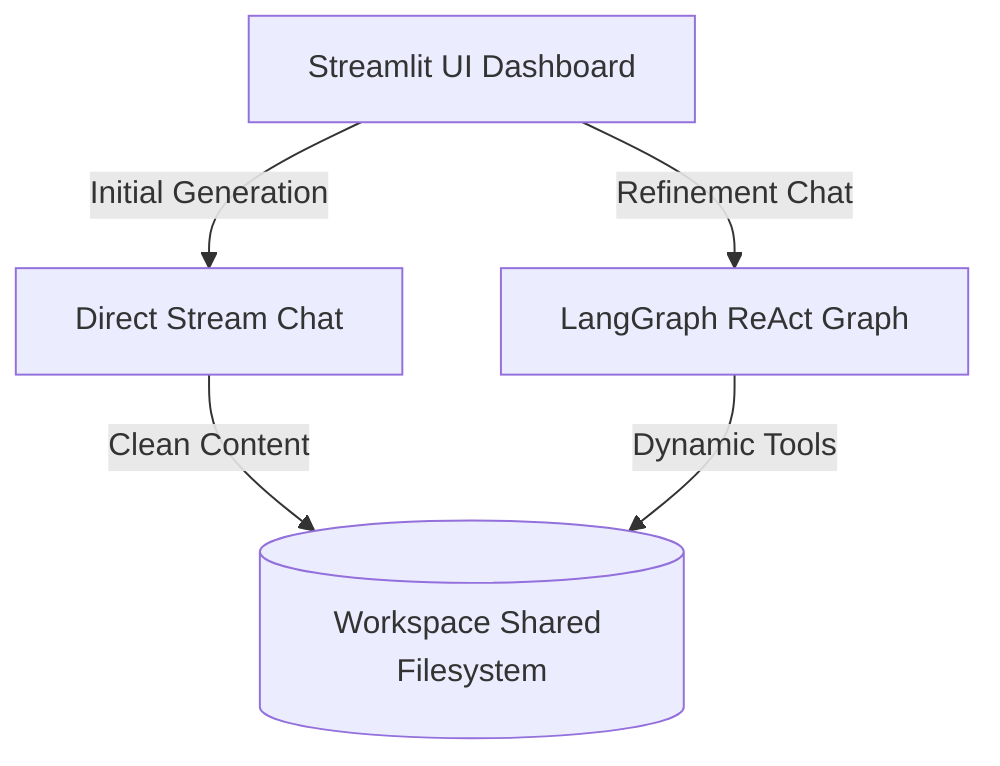
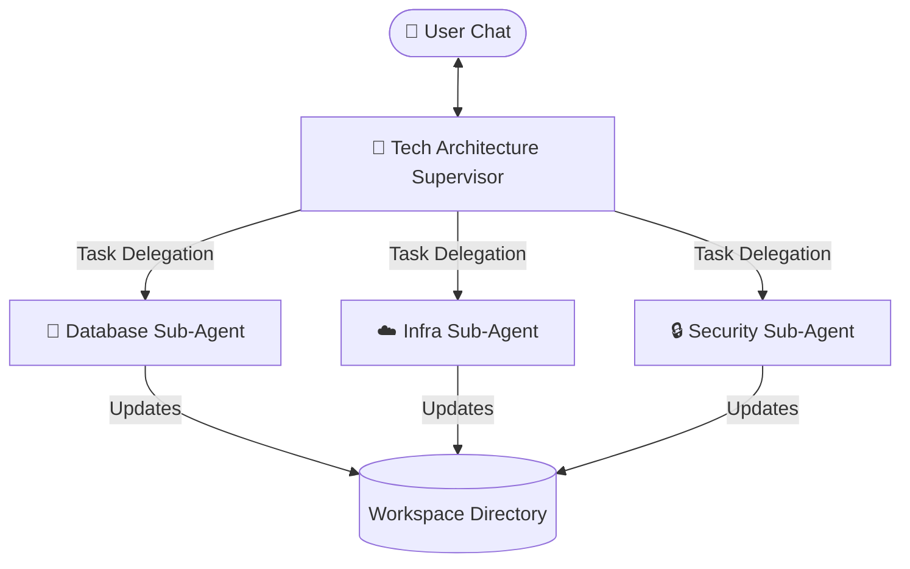

# 📑 IdeaToIndia Agentic Architecture Report

This report documents the architectural design, security mechanisms, and forward-looking roadmap for the **IdeaToIndia Strategy Agent Harness**.

---

## 🏛️ System Architecture Overview

The IdeaToIndia multi-agent system uses a hybrid model of **direct structured completions** and **stateful ReAct agent graphs** to optimize performance, real-time UI/UX, and editing capabilities.



---

## 🔄 Dual-Flow Execution Strategy

To balance streaming UI responsiveness with robust editing capabilities, the system uses two separate workflows:

### 1. Baseline Generation (Direct Stream Flow)
* **Goal:** Create the initial document structure (e.g., brand identity, requirements) as quickly as possible.
* **Mechanism:** Bypasses graph compilers, streaming LLM tokens directly to the screen via `execute_agent_stream` and `stream_chat`.
* **Benefit:** Instant UI feedback, 100% adherence to prompt templates, and zero conversational overhead.

### 2. Document Refinement (LangGraph Refiner Flow)
* **Goal:** Allow multi-turn conversation to edit, expand, or fix sections of the document.
* **Mechanism:** Compiles a stateful LangGraph using `create_agent` with dynamic workspace tools.
* **Benefit:** Injects middleware for retry logic, context summarization, and allows the model to interact with the file system directly via tool usage.

---

## 🧼 Workspace Isolation & Sanitation Pipeline

To keep the workspace organized and free of AI conversational clutter, all agents write to isolated directories.

### Path Resolution
The active project workspace is isolated using a central utility in `utils.py`:
```python
def get_docs_dir():
    # Resolves to: documents/<project_folder_name>/
```

### Automatic Sanitation
When files are written, `save_document` intercepts the content and cleans it using `clean_markdown_document`:

```python
def clean_markdown_document(content: str) -> str:
    # 1. Strips out outer markdown fences (e.g. ```markdown ... ```)
    # 2. Strips out conversational preambles before the first heading (## or ---)
```

---

## 📈 Scalability Roadmap: Hierarchical Agent Teams

As the **Technical Architecture** and **Roadmap/Planning** stages grow in complexity, a single-prompt ReAct agent will fail to scale due to context congestion and tool bloat. 

We recommend transitioning to a **Supervisor Pattern** using LangGraph:



### Key Expansion Steps:
1. **Define Sub-Nodes:** Isolate Database, Cloud Infra, and Security audits into separate sub-agent prompts and custom tools.
2. **Build Router Nodes:** Define conditional routing rules inside LangGraph so the supervisor routes dynamically based on user needs.
3. **Keep UI Intact:** The Streamlit frontend only communicates with the supervisor node, leaving the sub-agent orchestration transparent to the user.
